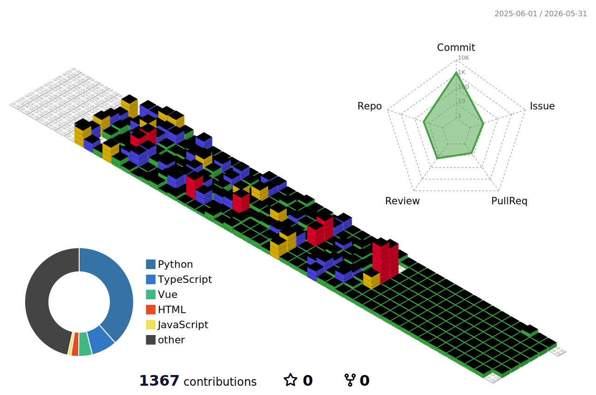

<!--
**duuujin/duuujin** is a ✨ _special_ ✨ repository because its `README.md` (this file) appears on your GitHub profile.

Here are some ideas to get you started:

- 🔭 I’m currently working on ...
- 🌱 I’m currently learning ...
- 👯 I’m looking to collaborate on ...
- 🤔 I’m looking for help with ...
- 💬 Ask me about ...
- 📫 How to reach me: ...
- 😄 Pronouns: ...
- ⚡ Fun fact: ...
-->

    <!-- 

    
    

    -->
    
 
    <h2 style="border-bottom: 1px solid #d8dee4; color: #282d33;">  </h2>  
    
  
 
    

    

    <h2 style="border-bottom: 1px solid #d8dee4; color: #282d33;"> 🛠️ Tech Stacks </h2>   
    
 
          
          
          
          
           

    

    
    <!-- 
 
    <!-- <h2 style="border-bottom: 1px solid #d8dee4; color: #282d33;"> 🏅 Stats </h2> 
  -->
        <!--  -->
        <!--  
  -->
    

<!--  -->
